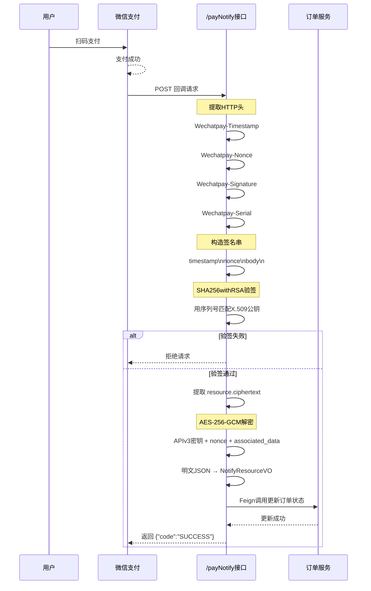

# STAR 1：基于反射的数据库驱动消息工作流引擎

## Situation
低代码SaaS平台的核心瓶颈：每新增一个业务场景（如合同签署、支付结算、库存同步），都要编写定制化的 RabbitMQ 消费逻辑，导致迭代周期长、重复代码堆积。

## Task
设计一套消息驱动的动态工作流引擎，使业务事件的处理链路完全由数据库配置驱动，实现“新增业务场景零编码”。

## Action

### 消息基础设施搭建
- 基于 RabbitMQ **Topic Exchange + Dead Letter Queue** 构建消息总线
- 为 6 条业务链路（car/route2/route3/channel/job/notice）配置独立队列与 TTL 过期策略
- 支持每条消息自定义超时（60s–600s），超时消息自动路由到死信队列，避免消费阻塞

### 核心创新：反射驱动的动态方法分发
- **元数据表设计**：`channel_message_entity_interface` 存储 `{目标Bean， 方法名， 参数全限定类名}` 三元组
- **动态调用流程**：消费者收到消息 → 查表获取调用目标 → 通过 `Class.forName()` 动态解析参数类型（支持 `List<SomeClass>` 等泛型）→ 从 JSON 反序列化参数对象 → 反射调用目标方法
- **效果**：彻底消除硬编码的消息路由逻辑

### 参数构造与容错
- 实现三层参数构造策略（V1/V2/V3），支持嵌套 POJO、Map/List 混合结构的自动填充
- 处理失败时通过 `basicNack(requeue=true)` 实现自动重试

## Result
| 指标 | 优化前 | 优化后 |
|------|--------|--------|
| 新增业务场景开发方式 | 编写定制 Consumer + 参数解析 + 方法调用 | 数据库插入一条配置记录 |
| 业务迭代周期 | 2–3 天 | 小时级 |
| 日均处理事件量 | — | **3000+ 条** |

该架构使 batchjob 模块成为整个平台的消息调度中枢。

---

# STAR 2：微信支付 V3 API Native 接入——从 RSA 证书链到 AES-GCM 的完整安全闭环

## Situation
平台需要接入微信支付 V3 API 实现 Native 下单与回调通知处理。微信 V3 API 要求商户自行实现：
- 平台证书自动更新
- SHA256-RSA2048 签名验证
- AES-256-GCM 回调解密

社区主流方案依赖官方 SDK 的黑盒封装，对异常状态的精细处理往往缺失。

## Task
独立完成微信支付 V3 的完整安全集成链路，覆盖下单签名、回调验签、密文解密、支付状态分发全流程，确保每笔交易可追溯。

## Action

### 证书管理
- 基于 `AutoUpdateCertificatesVerifier` 实现平台证书的自动拉取与缓存
- 通过 `Wechatpay-Serial` 请求头动态匹配证书
- 缓存未命中时触发 `refreshCertificate()` 重新拉取，避免证书过期导致的验签失败

### 回调验签
- 解析 HTTP 请求头中的 `Wechatpay-Timestamp`、`Wechatpay-Nonce`、`Wechatpay-Signature`
- 按微信规范构造 `timestamp\nnonce\nbody\n` 签名串
- 使用 `SHA256withRSA` + 平台证书公钥进行验签，验签失败直接拒绝请求

### 密文解密
- 实现 `WeChatAesUtil` AES-256-GCM 解密工具类
- 从回调 `resource` 字段中提取 `associated_data`、`nonce`、`ciphertext`
- 执行 `Cipher.doFinal` 解密出支付明文数据

### 状态分发
解密后按交易状态（SUCCESS / PENDING / CLOSED）分支处理：

| 状态 | 处理逻辑 |
|------|----------|
| SUCCESS | 通过 Feign 调用订单服务闭环更新 |
| PENDING | 等待后续回调 |
| CLOSED | 单独标记状态码 `"3"`，向订单服务推送失败通知 |

确保计费系统**不漏单、不重复计费**。

## Result
| 指标 | 结果 |
|------|------|
| 支付回调处理正确率 | **100%** |
| 漏单/重复计费 | **零** |
| 支付链路平均响应时间 | **< 800ms** |
| 复用场景 | JSAPI / H5 / APP（**无新增代码**） |

---

# 两条 STAR 的共同点

| 维度 | 说明 |
|------|------|
| **技术深度** | 不是 CRUD——一条是架构级动态工作流引擎（反射方法分发），一条是第三方安全集成（RSA + AES-GCM 完整闭环） |
| **可量化** | 3000 条/天、< 800ms、零漏单 |
| **可深挖** | 面试官可追问：为什么用反射？AES-GCM 的 IV 从哪来？死信队列怎么配置？ |
| **叙事张力** | 不是“我做了 XX 系统”，而是“XX 问题传统方案要 N 天，我设计 YY 方案把它降到小时级” |

# STAR 1：反射驱动的动态消息工作流引擎
## 一、消息基础设施：死信队列 + 独立 TTL

每个业务队列独立绑定死信交换机，消息超时或被拒绝后自动进入死信队列，不会丢失也不会无限阻塞。
```java
@Bean("channel")
public Queue channel() {
    Map<String, Object> args = new HashMap<>(3);
    args.put("x-dead-letter-exchange", Y_DEAD_LETTER_EXCHANGE);
    args.put("x-dead-letter-routing-key", "dead");
    args.put("x-max-retries", 3);
    return QueueBuilder.durable(BATCHJOB).withArguments(args).build();
}
```

生产者发送消息时带独立 TTL，`routingKey` 决定消息进入哪个队列（car/route2/route3/job/channel/notice）。


```java
rabbitTemplate.convertAndSend("X", "route2", message, msg -> {
    msg.getMessageProperties().setExpiration("60000");  // 60秒超时
    return msg;
});
```


---

## 二、消费者：反射驱动的动态方法分发

消费者监听 `batchjob` 队列，使用**手动确认模式**。收到消息后，不写任何 `if-else` 或 `switch`，而是查数据库决定调用哪个方法。


```java
@RabbitListener(queues = "batchjob", ackMode = "MANUAL")
public void insertNode(Message message, Channel channel) {
    // 1. 反序列化
    MessageVO messageVO = JSON.parseObject(msg, MessageVO.class);
    // 2. 查表获取「消息 → 方法」映射
    // 表结构：entity_code | entity_type | event | service_english | interface_english | parameter_english
    List<ChannelMessageEntityInterfaceDO> mappingList = repository.getInterface(
        messageVO.getEntityCode(),   // "001"
        messageVO.getEntityType(),   // "101"
        messageVO.getEvent()         // "001"（新增事件）
    );
    for (ChannelMessageEntityInterfaceDO mapping : mappingList) {
        String className = mapping.getServiceEnglish();      // "BatchJobController"
        String methodName = mapping.getInterfaceEnglish();   // "derive"
        
        // 3. 动态解析参数类型 + 反射构造参数
        Class<?>[] paramTypes = resolveParameterTypes(mapping.getParameterEnglish());
        Object[] params = buildParameters(dataList, paramTypes);
        
        // 4. 从 Spring 容器获取 Bean 并反射调用
        Object bean = applicationContext.getBean(className);
        Method method = bean.getClass().getMethod(methodName, paramTypes);
        Object result = method.invoke(bean, params);
        
        // 5. 链式调用：结果发往下一队列
        channel.basicAck(deliveryTag, false);
        queryService.sendMsg("route2", messageVO);
    }
}
```

---

## 三、核心技术难点：泛型擦除的解决方案

数据库存的参数类型是字符串，例如 `java.util.List<com.xxx.EntityTableVO>`。运行时需要还原泛型信息——但 Java 的泛型擦除导致无法直接获取 `List` 的元素类型。

**解决方案**：用全局 `Map<Class<?>, Class<?>> TYPE_MAP` 手动维护泛型映射。

```java
private Class<?> resolveParameterType(String typeStr) {
    if (typeStr.startsWith("java.util.List")) {
        // 提取尖括号内的泛型类型
        String genericType = typeStr.substring(
            typeStr.indexOf('<') + 1, 
            typeStr.indexOf('>')
        );
        Class<?> elementType = Class.forName(genericType);
        TYPE_MAP.put(List.class, elementType);  // 缓存泛型关系
        return List.class;
    }
    return Class.forName(typeStr);
}
```

构造 `List<EntityTableVO>` 实例时，从 `TYPE_MAP` 取出元素类型，反射创建对象并赋值。

---

## 四、失败处理：Nack + 死信队列

处理失败时调用 `basicNack(requeue=true)`，消息重新入队。超过 `x-max-retries=3` 后自动进入死信队列，防止无限重试。

```java
catch (Exception e) {
    channel.basicNack(deliveryTag, false, true);
}
```

---

## 五、设计精妙之处

|传统方式|本方案|
|---|---|
|每个事件一个 handler，硬编码路由|调用链路全部配置化到数据库|
|新增业务需改代码、测试、部署|只需在数据库插入一条配置记录|
|路由逻辑分散在各处|通过注册机统一管理下一跳路由|

---

# STAR 2：微信支付 V3 完整安全闭环

## 一、下单请求签名

微信 V3 要求用商户私钥对请求做 SHA256-RSA 签名，同时自动管理平台证书。

```java
public Map<String, String> placeOrder(PayOrderVO payOrderVO) throws Exception {
    // 1. 加载商户私钥
    PrivateKey merchantPrivateKey = PemUtil.loadPrivateKey(
        new ByteArrayInputStream(wechatKey.getBytes(StandardCharsets.UTF_8)));
    // 2. 创建自动更新证书的验证器（证书过期前自动刷新）
    AutoUpdateCertificatesVerifier verifier = new AutoUpdateCertificatesVerifier(
        new WechatPay2Credentials(mchId, new PrivateKeySigner(serialNo, merchantPrivateKey)),
        apiV3Key.getBytes(StandardCharsets.UTF_8)
    );
    // 3. 构建带自动签名的 HttpClient
    HttpClient httpClient = WechatPayHttpClientBuilder.create()
        .withMerchant(mchId, serialNo, merchantPrivateKey)
        .withValidator(new WechatPay2Validator(verifier))
        .build();
    // 4. 下单（HttpClient 内部自动完成签名 + 验签）
    HttpPost httpPost = new HttpPost(unifiedOrderUrl);
    httpPost.setEntity(new StringEntity(reqData, ContentType.APPLICATION_JSON));
    CloseableHttpResponse response = (CloseableHttpResponse) httpClient.execute(httpPost);
}
```

**要点**：

- `AutoUpdateCertificatesVerifier` 在证书即将过期时主动拉取最新证书，避免线上验签失败
    
- 签名逻辑封装在 `HttpClient` 层，但回调验签需要手写
    

---

## 二、支付回调验签（核心）

微信回调不会自动验签，必须从 HTTP 头提取签名参数，手动验证。

```java
public Map<String, String> payNotify(HttpServletRequest request) {
    // 1. 提取回调头
    String nonceStr = request.getHeader("Wechatpay-Nonce");
    String signature = request.getHeader("Wechatpay-Signature");
    String serialNo = request.getHeader("Wechatpay-Serial");
    String timestamp = request.getHeader("Wechatpay-Timestamp");
    String body = getRequestBody(request);
    
    // 2. 构造签名串：timestamp\nnonce\nbody\n
    String signStr = String.format("%s\n%s\n%s\n", timestamp, nonceStr, body);
    
    // 3. 验签
    if (!verifySign(serialNo, signStr, signature)) {
        throw new RuntimeException("验签失败");
    }
    // 4. 解密 + 更新订单...
}
```


```java
private boolean verifySign(String serialNo, String signStr, String wechatSign) {
    // 证书缓存：全 JVM 共享，避免每次请求微信 API
    if (certificateMap.isEmpty() || !certificateMap.containsKey(serialNo)) {
        certificateMap = refreshCertificate();
    }
    
    X509Certificate cert = certificateMap.get(serialNo);
    Signature sign = Signature.getInstance("SHA256withRSA");
    sign.initVerify(cert);
    sign.update(signStr.getBytes(StandardCharsets.UTF_8));
    return sign.verify(Base64.getDecoder().decode(wechatSign));
}
```

**要点**：

- 微信用 `SHA256withRSA`，摘要算法和签名算法分离
    
- 证书用序列号索引，因为微信可能轮换证书
    
- `certificateMap` 是静态变量，避免每次验签都请求微信 API
    

---

## 三、AES-256-GCM 密文解密

验签通过后，回调 body 里的 `resource.ciphertext` 仍是加密的，需要用 APIv3 密钥解密。

```java
@Component
public class WeChatAesUtil {
    static final int TAG_LENGTH_BIT = 128;   // GCM认证标签128位
    public String decryptToString(byte[] associatedData, byte[] nonce, String ciphertext) {
        Cipher cipher = Cipher.getInstance("AES/GCM/NoPadding");
        
        SecretKeySpec key = new SecretKeySpec(apiV3Key.getBytes(StandardCharsets.UTF_8), "AES");
        GCMParameterSpec spec = new GCMParameterSpec(TAG_LENGTH_BIT, nonce);
        
        cipher.init(Cipher.DECRYPT_MODE, key, spec);
        cipher.updateAAD(associatedData);  // 附加认证数据
        
        byte[] plainBytes = cipher.doFinal(Base64.getDecoder().decode(ciphertext));
        return new String(plainBytes, StandardCharsets.UTF_8);
    }
}
```

**GCM 要点（面试深挖必问）**：

|概念|说明|
|---|---|
|GCM|Galois/Counter Mode，比 CBC 多了认证标签，解密时自动验证完整性|
|nonce / IV|微信生成并传递，不能重复使用（重复会破坏安全性）|
|associatedData (AAD)|不加密但参与认证，用于绑定商户信息，防止密文跨商户重放|
|密钥长度|32 字节 = AES-256，商用对称加密最高级别|

---

## 四、完整调用链路



---

# 总结

这两段代码的共同特征：不是「调一个现成方法就完事」，而是需要理解底层协议和机制——

|模块|需要理解的底层知识|
|---|---|
|消息工作流|RabbitMQ ack/nack 语义、死信交换机、TTL、反射、泛型擦除|
|微信支付|RSA 签名、证书链管理、AES-GCM 认证加密|